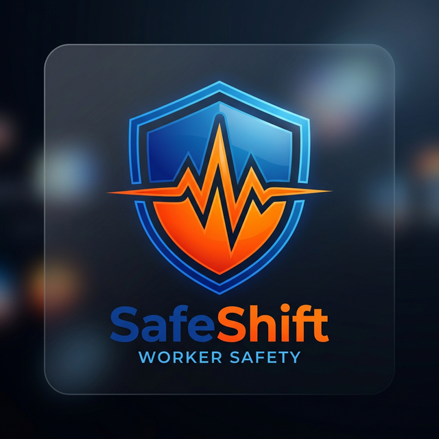

# 🛡️ SafeShift | Human Performance Lab

<p align="center">
  
</p>

**SafeShift** is a high-fidelity, production-grade mobile dashboard prototype designed for the **Human Performance Lab**. It leverages native iOS design principles to provide real-time safety monitoring, ergonomic feedback, and injury reporting for industrial workers, supervisors, and safety officers.

### 🚀 [View Live Prototype](https://dreamerskymaster.github.io/SafeShift-HumanPerformance/)

---

## 🌟 Key Features

### 👷 Worker Dashboard
*   **Live Vitals Monitoring**: Track heart rate, skin temperature, and fatigue indices in real-time.
*   **Dynamic Posture Alerts**: Real-time notifications for ergonomic risks (e.g., forward lean detected).
*   **Body Map Symptom Logging**: Interactive anatomical interface for precise discomfort tracking.
*   **Guided Recovery**: Personalized stretching exercises based on logged pain areas.

### 👥 Supervisor Team View
*   **Fleet Status**: High-level overview of team fatigue and safety compliance.
*   **Active Alert Tracking**: Instant visibility into high-risk ergonomic incidents across the floor.
*   **Metric Trends**: Daily and weekly fatigue/injury trend analysis.

### 🛡️ Safety Officer Suite
*   **Hotspot Analysis**: Identify high-risk production lines and ergonomic "hotspots".
*   **Incident Reporting**: Robust digital injury reporting integrated with wearable data.
*   **Comparative Analytics**: Benchmarking across lines and shifts to optimize floor safety.

---

## 🛠️ Technology Stack

*   **Core**: React 18
*   **Tooling**: Vite (for ultra-fast HMR and building)
*   **Styling**: High-fidelity Vanilla CSS & HSL Design System
*   **Design Standards**: Apple Human Interface Guidelines (HIG)
*   **Deployment**: GitHub Pages

---

## 💻 Local Development

To run the project locally, ensure you have [Node.js](https://nodejs.org/) installed, then:

1.  **Clone the repository**:
    ```bash
    git clone https://github.com/dreamerskymaster/SafeShift-HumanPerformance.git
    cd SafeShift-HumanPerformance
    ```

2.  **Install dependencies**:
    ```bash
    npm install
    ```

3.  **Start the development server**:
    ```bash
    npm run dev
    ```

4.  **Build for production**:
    ```bash
    npm run build
    ```

---

## 📐 Design Philosophy

SafeShift adheres to the **CRAP** principles of design:
*   **C**onstrast: Sharp visual hierarchy between critical alerts and routine metrics.
*   **R**epetition: Consistent iconography and spacing patterns across all roles.
*   **A**lignment: Precise grid structures following the iPhone 14/15 Pro Max layout (430x932).
*   **P**roximity: Grouped functional blocks (Vitals, Quick Actions, Stats) for intuitive navigation.

---

### 🎓 Academic Context
This project was developed for **Lab 4 of the Human Performance course** at Northeastern University. It serves as a Proof of Concept (POC) for integrating wearable technology with industrial safety management.

---
**SafeShift** - *Empowering Workers, Ensuring Safety.*
